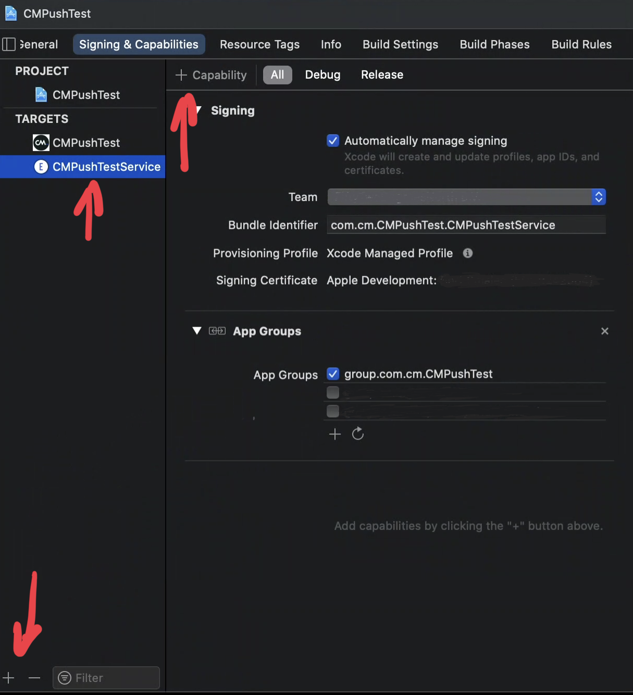
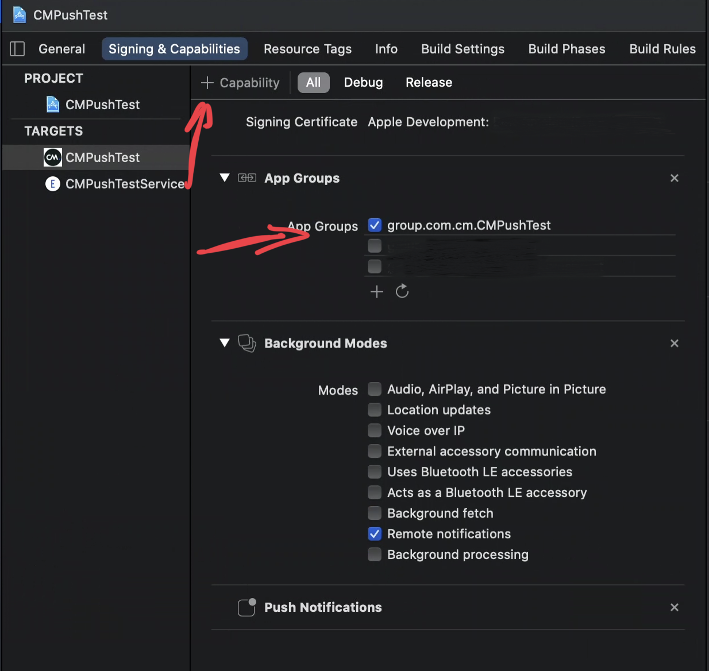
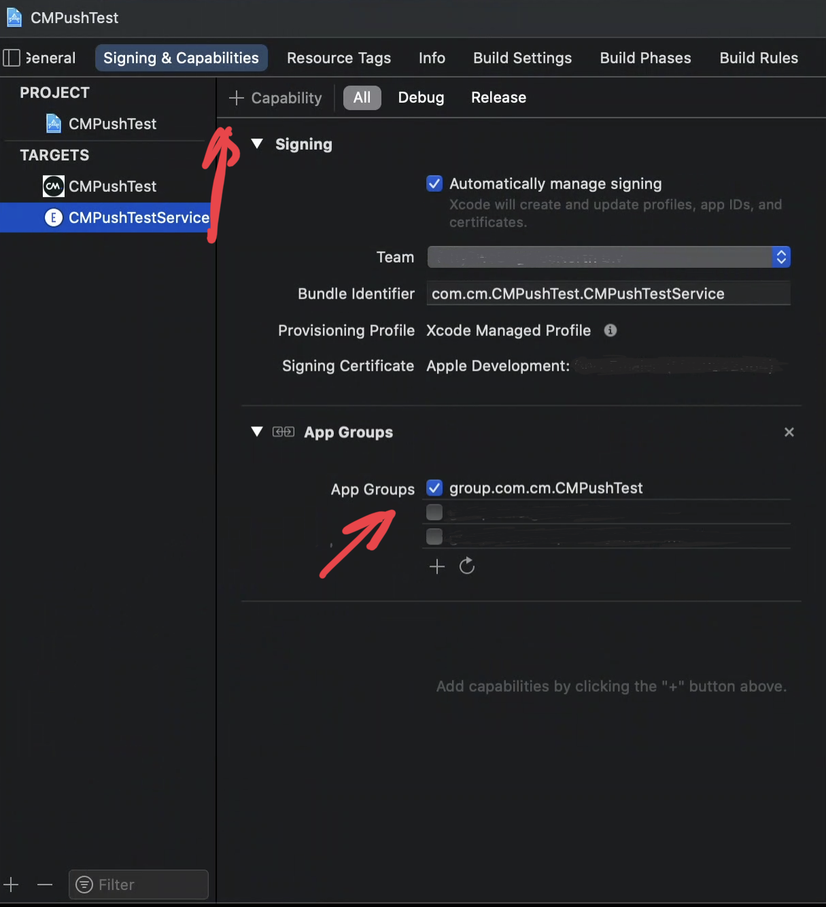
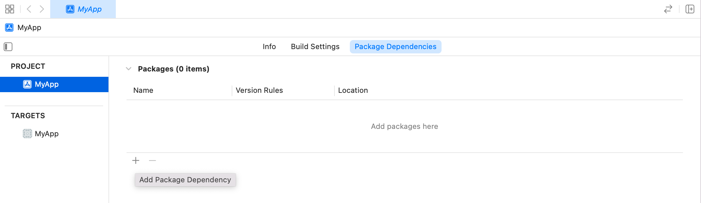
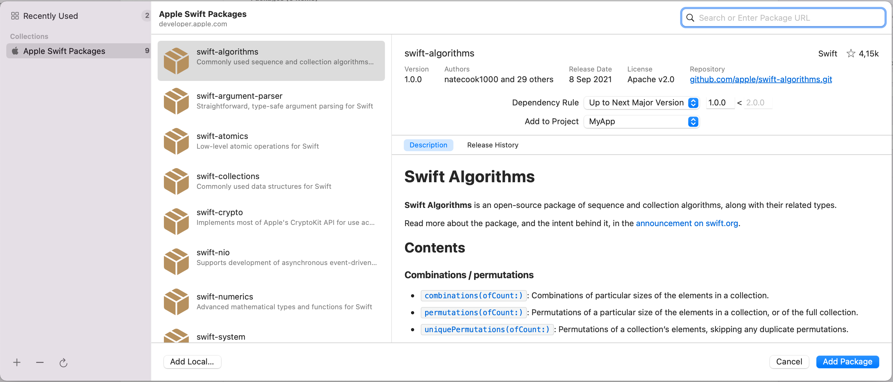
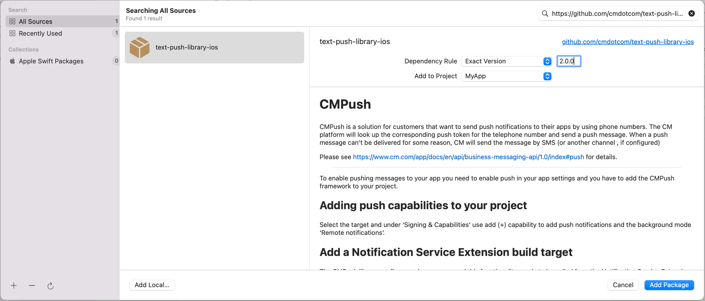
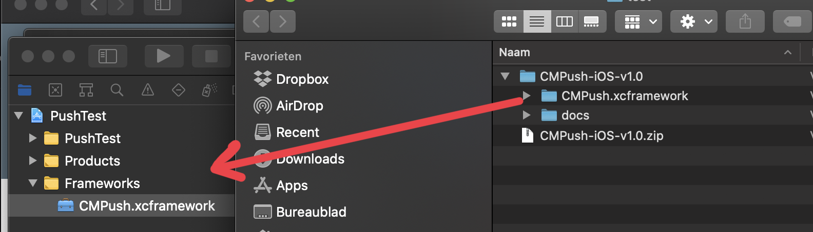
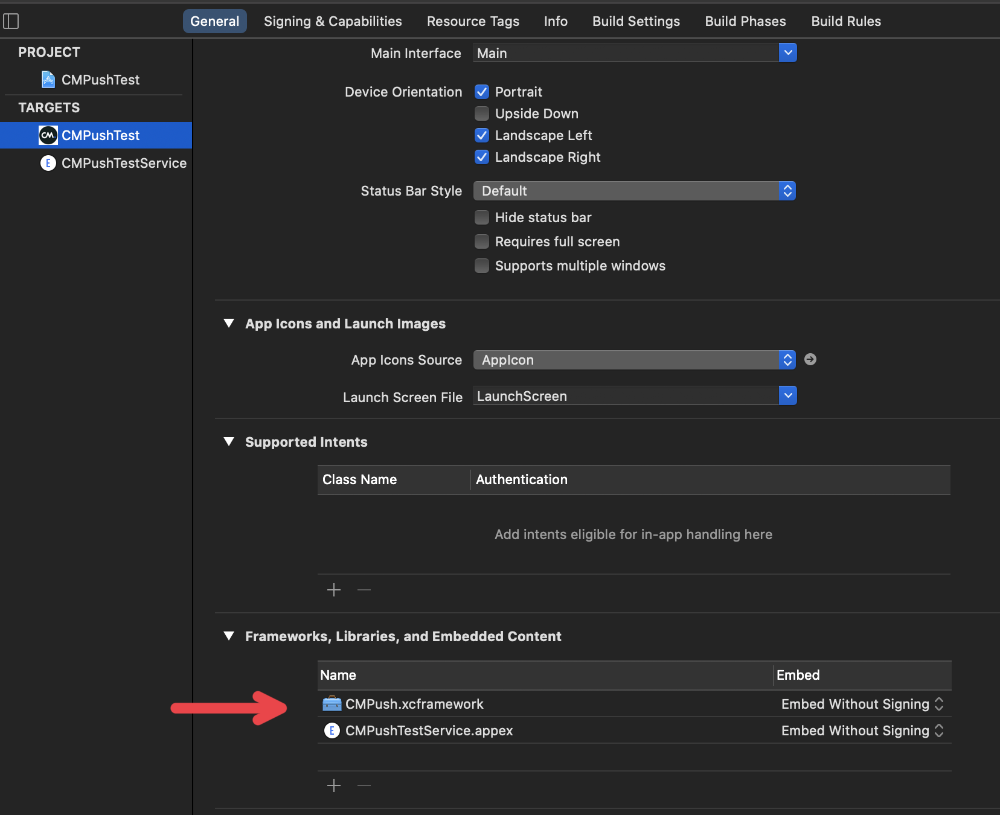
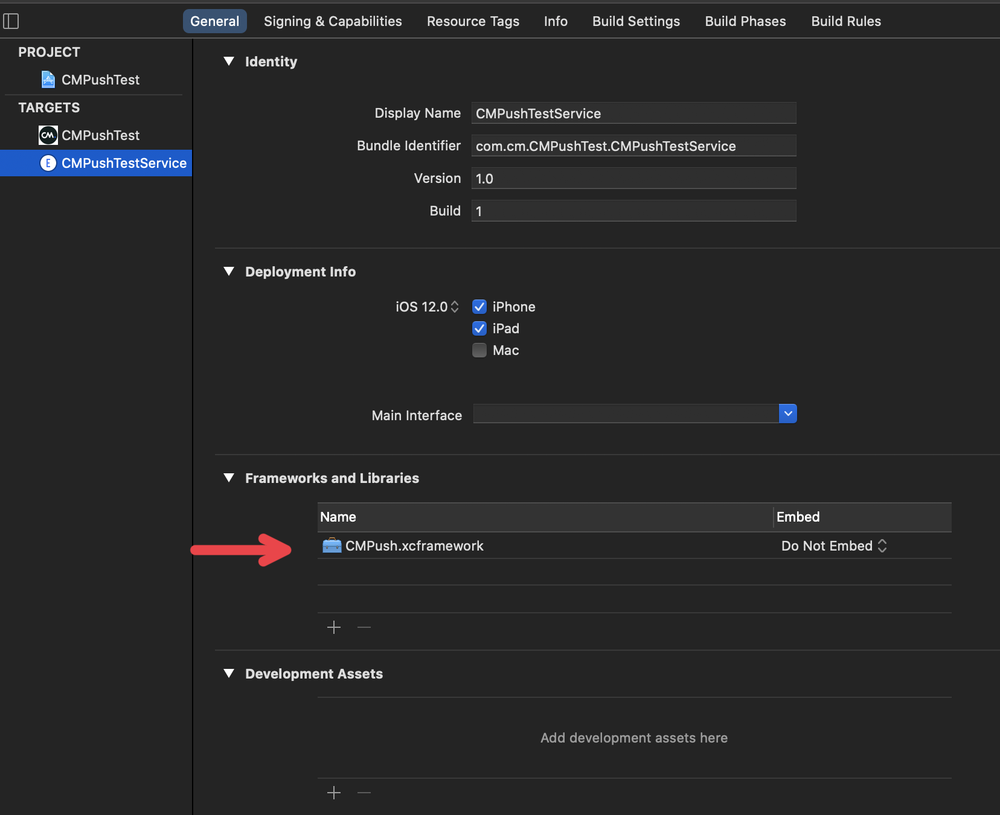

# CMPush

CMPush is a solution for customers that want to send push notifications to their apps by using phone numbers. 
The CM platform will look up the corresponding push token for the telephone number and send a push message. When a push message can't be delivered for some reason, CM will send the message by SMS (or another channel , if configured)

---
# RELEASE NOTES

## 2.0.0

##### Breaking

* The SDK now always registers to the server with the ``CMPush_UpdateToken(deviceToken:withResult:)`` call. There is no mechanism to unregister.

* ``CMPush_UpdateToken(deviceToken:withResult:)`` now returns the installationID or a ``CMPushError`` in the completion handler. Use the installationID to send push messages to your customers if the MSISDN OTP flow is not needed. The installationID can be added to the customer account for example. Call ``CMPush_UnregisterMSISDN(withResult:)`` when the user logs out. Don't perform ``CMPush_UpdateMSISDN(_:withResult:)`` before the installationID was received.

* ``CMPush_PreRegister(msisdn:sender:withResult:)`` is deprecated and replaced with ``CMPush_UpdateMSISDN(_:withResult:)``. Use this call after ``CMPush_UpdateToken(deviceToken:withResult:)`` completed successfully to start OTP flow.

* ``CMPush_Register(msisdn:otpCode:withResult:)`` is deprecrated and replaced with ``CMPush_UpdateOTP(msisdn:otp:withResult:)``. Use this call to send the OTP code to the server.

* ``CMPush_DeleteRegistration(withResult:)`` is deprecated and replaced with ``CMPush_UnregisterMSISDN(withResult:)``. Use this call to unregister the MSISDN from the push installation. 

* Addded ``CMPush_UpdatePushAuthorization()`` to inform the server when the user allowed push or not.

* ``CMPush_StatusReport(bestAttemptContent:withResult:)`` is deprecated and replaced with ``CMPush_HandleNotificationRequest(_:withContentHandler:)``. Update your ``UNNotificationServiceExtension`` code as shown in ``CMPush_HandleNotificationRequest(_:withContentHandler:)``

* Added ``CMPush_HandleNotificationResponse(_:withCompletionHandler:)`` to handle button-presses and report read/dismissed status to CM server.

* ``CMPush_IsRegistered()`` now checks if the SDK is registered with the CM server. Use ``CMPush_HasRegisteredMSISDN()`` to check wether a MSISDN was registered to this account.

* Added ``CMPush_InstallationID`` to retrieve the installationID (or null if not yet registered to CM server). Use the installationID to send push messages to your customers if the MSISDN OTP flow is not needed.

##### Upgrade guide
* Update your AppDelegate as described in ``CMPush_Config(applicationKey:groupName:)`` and ``CMPush_SetDelegate(_:)``
* Wait for ``CMPush_UpdateToken(deviceToken:withResult:)`` to return the installationID before starting `CMPush_UpdateMSISDN(_:withResult:)``. If no MSISDN verification is needed, store the installationID in the customer account.
* Replace your call to ``CMPush_PreRegister(msisdn:sender:withResult:)`` with ``CMPush_UpdateMSISDN(_:withResult:)``
* Replace your call to ``CMPush_Register(msisdn:otpCode:withResult:)`` with ``CMPush_UpdateOTP(msisdn:otp:withResult:)``
* Replace your call to ``CMPush_DeleteRegistration(withResult:)`` with ``CMPush_UnregisterMSISDN(withResult:)``
* Replace your call to ``CMPush_IsRegistered()`` with ``CMPush_HasRegisteredMSISDN()`` if you want to determine wether a MSISDN was registered.
* Update your NotificationService-extension as described in ``CMPush_HandleNotificationRequest(_:withContentHandler:)``
* Update your AppDelegate as described in  ``CMPush_HandleNotificationResponse(_:withCompletionHandler:)``

##### Enhancements

* Support for rich media in push notifications.
  Supported media are:
  - "audio/mpeg": MP3 audio (max 5MB)
  - "audio/m4a": MP4 audio (max 5MB)
  - "image/jpeg": JPG image (max 10MB)
  - "image/png": PNG image (max 10MB)
  - "video/mp4": MP4 video (max 50MB)

* Support for suggestions (actions) in push notifications.
  Supported actions are:
  - OpenUrl: website url. The app can choose to open it in the app for example or redirect to Safari
  - OpenAppPage: open a specific page in the app.
  Set the delegate, implement the delegate callback and call `CMPush_HandleNotificationResponse(...)` as described in the guide below.
  
* Report preferred language to the CM server to be able to localize messages
* Report Push Notification authorization status to the server to detect wether user has allowed push messages to be shown.
* Now also supports Push Notifications without SMS verification (OTP) flow. 

## 1.0.4
* Initial release

---

# ONBOARDING

Developers need to onboard at CM by providing a push certificate (.crt)

The onboarding process at CM will return a unique applicationKey, that needs to be passed into the library. 


# Adding CMPush to project

To enable CMPush you need to enable push in your app settings and you have to add the CMPush framework to your project. Next you have to add a Notification Service Extension. The CMPush library confirms push message and this functionality needs to be called from Notification Service Extension to be sure that is always called when iOS is receiving a CM Push message.


## Adding push to project

Select the target and use add (+) capability to add push notifications and the background mode 'Remote notifications'. See image for example.


## Adding Notification Service Extension build target

The CMPush library confirms push message and this functionality needs to be called from Notification Service Extension to be sure that is always called when iOS is receiving a CM Push message.

Use (+) to add a new target.





## Adding App Group to the project

To allow communication between the app and the notification service extension a group should be added to the app and the notification service. Use add (+) capabiliy to add an app group to your project and notification service. Use the same name for both of them.






## Add CMPush via Swift Package Manager

Use the following URL to directly add the package to your project: https://github.com/cmdotcom/text-push-library-ios

Open the Package Manager in XCode and click +



Insert the above URL in the searchfield on the right top:



Select "Exact Version" and select 2.0.0:




## Add CMPush XCframework manually

Copy CMPush XCFramework to project



Embed framework






## Enable push in AppDelegate

CM Push needs to be configured at application startup. Add CMPush_Config with account id and groupname to didFinishLaunchingWithOptions in the appdelegate. Call registerForRemoteNotifications to generate push token. In the didRegisterForRemoteNotificationsWithDeviceToken call CMPush_UpdateToken with the token.

Add also UNUserNotificationCenterDelegate to the app delegate and set the delegate in didFinishLaunchingWithOptions.

See example code.


``` Swift
import UIKit
import CMPush

@main
class AppDelegate: UIResponder, UIApplicationDelegate, UNUserNotificationCenterDelegate, CMPushDelegate {

    var window: UIWindow?

    func application(_ application: UIApplication, didFinishLaunchingWithOptions launchOptions: [UIApplication.LaunchOptionsKey: Any]?) -> Bool {
        // Configure CMPush
        #if DEBUG
        CMPush_SetApplePushEnvironment(.Sandbox)
        #endif
        
        CMPush_Config(applicationKey: "1234", groupName: "group.com.cm.CMPushTest")
        
        CMPush_SetDelegate(self)
        
        // Register push to get push token
        UIApplication.shared.registerForRemoteNotifications()
        
        // Alert notifications
        UNUserNotificationCenter.current().delegate = self
        return true
    }

    func application(_ application: UIApplication, didFailToRegisterForRemoteNotificationsWithError error: Error) {
        print("Remote notification is unavailable: \(error.localizedDescription)")
    }

    func application(_ application: UIApplication, didRegisterForRemoteNotificationsWithDeviceToken deviceToken: Data) {
        CMPush_UpdateToken(deviceToken: deviceToken){result in
            switch result {
            case .success(let installationID):
                print("CM PUSH INSTALLATION ID: \(installationID)")
            case .failure(let error):
                print("CM PUSH ERROR: \(error)")
            }
        }
    }
    
    func userNotificationCenter(_ center: UNUserNotificationCenter, didReceive response: UNNotificationResponse, withCompletionHandler completionHandler: @escaping () -> Void) {
        // Handle suggestions (buttons) clicked by the user
        CMPush_HandleNotificationResponse(response, withCompletionHandler: completionHandler)
    }

    //MARK:- CMPushDelegate protocol
    func cmPushHandleSuggestion(_ suggestion: CMPushSuggestion) {
        switch suggestion {
        case .openURL(let label, let url):
            UIApplication.shared.open(url, options: [:], completionHandler: nil)    // present the URL any way that fits this app
        case .openAppPage(let label, let page):
            print("Open app page: \(page)")
        @unknown default:
            break
        }
    }
}

```

## Pre-process received CM Push notifications in UNNotificationServiceExtension

CM Push needs to be configured in the NotificationService init. Add CMPush_Config with account id and groupname to init() in the service.
In the notification service add CMPush_HandleNotificationRequest to confirm delivery of push messages, download media and handle suggestions (actions). 

See example code.

@note 
CMPush_StatusReport is deprecated. Replace your UNNotificationServiceExtension code as show below.
The new API is simpler and can handle media and suggestions.

``` Swift
import UserNotifications
import CMPush

class NotificationService: UNNotificationServiceExtension {

    override init() {
        CMPush_Config(applicationKey: "1234", groupName: "group.com.cm.CMPushTest")
        super.init()
    }

    override func didReceive(_ request: UNNotificationRequest, withContentHandler contentHandler: @escaping (UNNotificationContent) -> Void) {
        CMPush_HandleNotificationRequest(request, withContentHandler: contentHandler)
    }
}
```

## Register MSISDN and trigger OTP flow

### Register

Use ``CMPush_UpdateMSISDN(_:withResult:)`` to register a new MSISDN to the CM push installation. This triggers an OTP sms.

``` Swift

    // Ask user permission
    let unCenter = UNUserNotificationCenter.current()
    unCenter.requestAuthorization(options: [.alert, .sound, .badge]) {granted,error in
        DispatchQueue.main.async {
            //Update authorization on the CM server
            CMPush_UpdatePushAuthorization()

            if granted {
                //Register MSISDN. Can also register if push is not granted if needed.
                CMPush_UpdateMSISDN(msisdn) { result in
                    //Handle result.
                }
            } else {
                //Push not allowed.
            }
        }
    }
```

### Verify OTP

Use ``CMPush_UpdateOTP(msisdn:otp:withResult:)`` to verify an OTP that user has received by SMS, link a phone number to this device.

```
import CMPush
...
CMPush_UpdateOTP(msisdn: msisdn, otp: otpCode){result in
    //handle result
}
```


