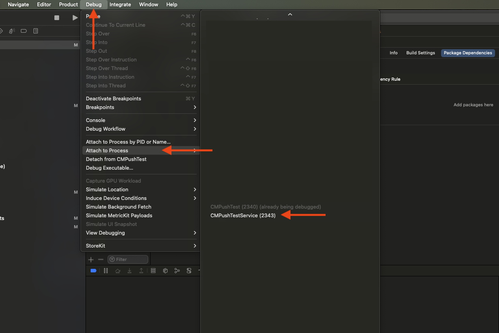

# CMPush

CMPush is a solution for sending rich push notifications to app users. These notifications support a **default action** (short tap) and long-press actions and media support for notifications.

---

## Table of Contents
1. [Introduction](#introduction)  
2. [Getting Started](#getting-started)  
   - [Prerequisites](#prerequisites)  
   - [Onboarding with CM](#onboarding-with-cm)  
3. [Installation](#installation)  
   - [Swift Package Manager](#swift-package-manager)  
   - [Manual Installation](#manual-installation)  
4. [Configuration](#configuration)
   - [Add Notification Service Extension target](#add-notification-service-extension-target)
   - [Setting Up AppDelegate](#setting-up-appdelegate)  
   - [Notification Service Extension](#notification-service-extension)  
5. [Changelog](#changelog)
   - [2.1.0](#210)
6. [Features](#features)  
7. [Troubleshooting](#troubleshooting)  
8. [Reference](#reference)  
   - [API Glossary](#api-glossary)  
9. [Appendices](#appendices)  
   - [Deprecated APIs](#deprecated-apis)
---

## Introduction

CMPush provides an easy-to-integrate library for delivering **rich media push notifications**. Key features include:  

- **Rich Media Support**
- **Single-tap Action**
- **Suggestions**
- **User Interaction Feedback**

---

## Requirements

### Prerequisites

- **Minimum iOS app deployment version**: 12.0 or newer  
- **Apple Developer Account**: An Apple Developer Account is required to create a push notification certificate.

### Onboarding with CM

To use CMPush, onboard with CM by:  

1. **Generating a Certificate**: Use the `.csr` file provided by CM to create an **Apple Push Notification service SSL (Sandbox & Production)** certificate in the [Apple Developer Portal](https://developer.apple.com/account/resources/certificates/list).  
2. **Obtaining Application Key**: CM will provide a unique `applicationKey`.

---

## Installation

### Swift Package Manager

1. Open Xcode and navigate to `File > Add Package Dependencies...`.  
2. Enter the repository URL: `https://github.com/cmdotcom/text-push-library-ios`.  
3. Select "Exact Version" and choose the latest release.  

### Manual Installation

1. Copy the `CMPush.xcframework` into your project.  
2. Go to your XCode project settings, select your App target `General > Frameworks, Libraries, and Embedded Content` and set the CMPush framework to "Embed & Sign".

---

## Configuration

### Add Notification Service Extension target
 -> Bool {
    
        #if DEBUG
        CMPush_SetApplePushEnvironment(.Sandbox)
        #endif
        CMPush_Config(applicationKey: "1234", groupName: "group.com.cm.CMPushTest")
        CMPush_SetDelegate(self)
        UIApplication.shared.registerForRemoteNotifications()
        UNUserNotificationCenter.current().delegate = self
        
        UNUserNotificationCenter.current().requestAuthorization(options: [.alert, .sound, .badge]) { granted, error in
            CMPush_UpdatePushAuthorization()
        }

        return true
    }
    
    func application(_ application: UIApplication, didFailToRegisterForRemoteNotificationsWithError error: Error) {
        print("Remote notification is unavailable: \(error.localizedDescription)")
    }

    func application(_ application: UIApplication, didRegisterForRemoteNotificationsWithDeviceToken deviceToken: Data) {
        CMPush_UpdateToken(deviceToken: deviceToken) { result in
            switch result {
                case .success(let installationID):
                    print("CM PUSH INSTALLATION ID: \(installationID)")
                case .failure(let error):
                    print("CM PUSH ERROR: \(error)")
            }
        }
    }
    
    // Handles interactions with notification
    func userNotificationCenter(_ center: UNUserNotificationCenter, didReceive response: UNNotificationResponse, withCompletionHandler completionHandler: @escaping () -> Void) {
        CMPush_HandleNotificationResponse(response, withCompletionHandler: completionHandler)
    }
    
    // Function that gets called when user pressed on an action
    func cmPushHandleSuggestion(_ suggestion: CMPushSuggestion) {
        switch suggestion {
            case .openURL(_, let url):
                UIApplication.shared.open(url, options: [:], completionHandler: nil)
            case .openAppPage(label: _, let page):
                print("Open app page: \(page)")
            @unknown default:
                break
        }
    }
}
```

---

### Notification Service Extension

Handle rich media notifications and delivery confirmations:  

```swift
import UserNotifications
import CMPush

class NotificationService: UNNotificationServiceExtension {
    override init() {
        #if DEBUG
        CMPush_SetApplePushEnvironment(.Sandbox)
        #endif
        CMPush_Config(applicationKey: "1234", groupName: "group.com.cm.CMPushTest")
        super.init()
    }

    override func didReceive(_ request: UNNotificationRequest, withContentHandler contentHandler: @escaping (UNNotificationContent) -> Void) {
        CMPush_HandleNotificationRequest(request, withContentHandler: contentHandler)
    }
}
```

---

## Changelog

### 2.1.0

**Added**
- Default action to notifications.
- Reply action for notifications.
- PrivacyInfo.xcprivacy file.

**Modified**
- Status report sent to CM when the user opens a notification.

**Fixed**
- Rich notification content not downloaded and displayed.

**Removed**
- Deprecated functions from version 1.

**Deprecated**
- SMS verification (OTP) flow functions.

**Updated**
- This `README.md` file for the latest changes.

---

## Features

### Rich Media Support

Supported media types:  

| Type            | Format        | Max Size |
|------------------|---------------|----------|
| Audio           | MP3 (audio/mpeg), MP4 (audio/m4a)| 5MB      |
| Images          | JPG (image/jpeg), PNG (image/png)| 10MB     |
| Video           | MP4 (video/mp4)| 50MB     |

### Default Action

Define a `defaultAction` in your push payload for single-tap actions. Example:  

```json
{...
  "defaultAction": {
    "action": "OpenUrl",
    "url": "https://example.com"
  }...
}
```

---

## Troubleshooting

### Common Issues

1. **Push Token Registration Fails**  
   - Ensure Push Notifications and Remote notifications in Background Modes are enabled in app capabilities.  
   - Check if `CMPush_UpdateToken` is called in `didRegisterForRemoteNotifications`.
   
2. **Not Receiving Notifications**
   - Make sure that `CMPush_SetApplePushEnvironment(.Sandbox)` is set for debug builds.

3. **Media And Suggestions Not Displayed/"Notification not preprocessed in UNNotificationServiceExtension. Make sure you have set up your project correctly according to the documentation." log message**
   - Check if `CMPush_HandleNotificationRequest` is called in the `didReceive` function of the Notification Service Extension.
   - Ensure that the App Group capability is enabled in XCode and Apple Developer Portal.
   - CMPush library is embedded/added in the Notification Service Extension target. Alternatively, Notification Service Extension is embedded in the main target.
   - Check if the Notification Service Extension is part of a Copy Files build phase with destination "PlugIns and Foundation Extensions" of the main app target. This should happen automatically when creating the Notification Service Extension.
   - Verify original media file size, media type and json structure of push payload.

4. **Not Seeing Logging Messages Of Extension**
   - Start app and send a notification to start the extension process.
   - Attach the debugger to the process by going to `Debug > Attach to Process` and selecting your extension from the list.


5. **Nothing Happening After Interacting With Notification**
   - Implement function `cmPushHandleSuggestion(suggestion)` in `extension AppDelegate : CMPushDelegate {}`

---

## Reference

### API Glossary

- `CMPush_Config(applicationKey:groupName:)`  
   Initializes CMPush with an application key and group name.

- `CMPush_SetDelegate`
   Set the AppDelegate so CMPush can call `cmPushHandleSuggestion(suggestion)`.

- `CMPush_SetApplePushEnvironment`
   Set the Apple environment that CM should use to send notifications. Use .Sandbox for Debug builds and .Production (default) for production builds.

- `CMPush_UpdatePushAuthorization`
   Update the registration at CM about the authorization given by the user to show push notifications.

- `CMPush_UpdateToken(deviceToken:withResult:)`  
   Registers the device token and returns an installation ID.

- `CMPush_HandleNotificationResponse(_:withCompletionHandler:)`
   Handle action that was pressed by the user.

- `CMPush_HandleNotificationRequest(_:withContentHandler:)`
   Pre-process the received CM Push NotificationRequest.

- `CMPush_IsRegistered`
   Returns true if registered to CM server.
   
- `CMPush_InstallationID`
   Returns installationID if registered to CM server.
---

## Appendices

### Deprecated APIs

The following APIs are deprecated and no longer supported:  

| API Method                                     | Used In Version | Replacement                           |
|------------------------------------------------|-----------------|---------------------------------------|
| `CMPush_PreRegister(msisdn:sender:withResult:)` | v1              | `CMPush_UpdateMSISDN(_:withResult:)` |
| `CMPush_Register(msisdn:otpCode:withResult:)`  | v1              | `CMPush_UpdateOTP(msisdn:otp:withResult:)` |
| `CMPush_StatusReport(bestAttemptContent:withResult:)` | v1         | `CMPush_HandleNotificationRequest(_:withContentHandler:)` |
| `CMPush_DeleteRegistration(withResult:)`       | v1              | `CMPush_UnregisterMSISDN(withResult:)` |
| `CMPush_UpdateMSISDN(_:withResult:)`           | v2              | Not replaced                          |
| `CMPush_UpdateOTP(msisdn:otp:withResult:)`     | v2              | Not replaced                          |
| `CMPush_UnregisterMSISDN(withResult:)`         | v2              | Not replaced                          |
| `CMPush_HasRegisteredMSISDN`                   | v2              | Not replaced                          |


---
